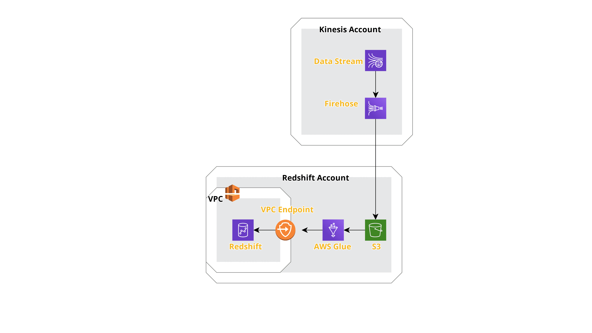

# kinesis-to-redshift
Terraform for kinesis firehose to a private redshift cluster

## Architecture:


### Implementation:
To generate records for the firehose to consume I used the AWS data generator here https://awslabs.github.io/amazon-kinesis-data-generator/ in the kinesis AWS account

I was able to get the data into the target s3 bucket, however this created one combined json file for both customer JSON payloads ([utm and event](example-data/kinesis-jimdo-test-stream-1-2021-02-13-17-52-48-ba0433e7-d11a-4155-a498-5a3820259c71)).

This was my first experience with AWS glue and I was struggling with the implementation to decouple the JSON records in large JSON file from the firehose output. An AWS glue crawler I was using, generated a flat table schema from the s3 bucket files which would not be compatible for the target redshift tables. I was then trying to use AWS glue jobs to transform the large schema into the two correct schema formats for the user_utm and user_event tables to upload them to the redshift cluster but I ran out of time before doing so.

Lastly, I would do some cleanup and orginization on my terraform code. Right now I have two different sets of code so I would need to run apply/plan twice, which I would prefer to decouple. I initially did this to not have a redshift cluster running when I was testing. The AWS module for redshift that I am using also seems to be a little buggy, it takes two terraform applies to generate the IoC due to VPC existing complaints. I believe this has to do with the AWS VPC / Security group modules and there compatibility.

### How to run
```shell
terraform init tf-kinesis-firehose
terraform apply tf-kinesis-firehose

terraform init tf-redshift-cluster
terraform apply tf-redshift-cluster
( first time will cause a failure, a feature not a bug ;) )
terraform apply tf-redshift-cluster
```
### To do:
- There still needs to be terraform for the AWS glue to transform data files from S3 into the redshift cluster.
- Combine terraform code for redshift cluster and kinesis dependancies